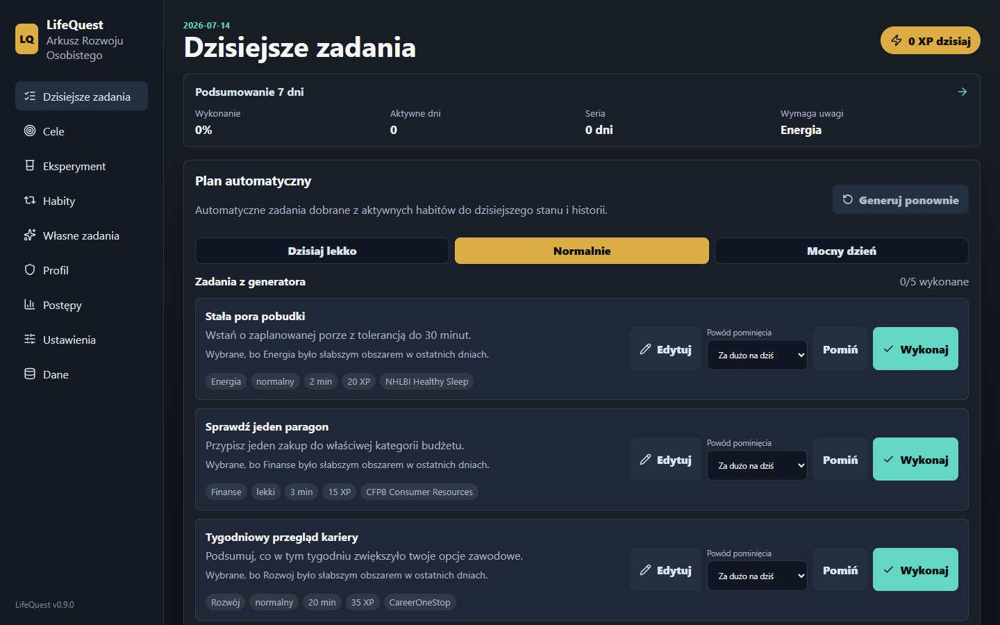

# LifeQuest

[English version](README.md)

Lokalny panel rozwoju osobistego do zarządzania celami, planem tygodnia, codziennymi działaniami, nawykami opartymi na źródłach, przeglądami postępów i lekką grywalizacją.

## Aktualny status

Wersja **0.9.0** jest aktualnym publicznym wydaniem. LifeQuest działa w całości w przeglądarce i nie wymaga konta, backendu ani usługi chmurowej. Kod źródłowy jest publiczny, natomiast cele, zadania, check-iny, notatki, kopie zapasowe i snapshoty bezpieczeństwa pozostają na urządzeniu użytkownika.



## Czym jest LifeQuest?

LifeQuest łączy cele, codzienne działania, nawyki oparte na sprawdzonych źródłach i check-iny w uporządkowany panel postępów. Obejmuje takie obszary jak energia, ciało, umysł, skupienie, rozwój, finanse i relacje, bez automatycznej interpretacji prywatnych notatek.

## Funkcje

- Cele kierunkowe i wynikowe ze stanami: aktywny, wstrzymany i zakończony.
- Plan tygodnia z jednym do trzech priorytetów, następnymi krokami, wersją minimum i planem przeszkód.
- Automatyczne przenoszenie niedokończonych priorytetów do szkicu kolejnego tygodnia.
- Przegląd tygodnia oparty na wykonanych krokach, bez analizy znaczenia prywatnych notatek.
- Jeden aktywny eksperyment rozwojowy na 7 lub 14 dni, tworzony z nawyku albo kroku tygodnia.
- Pełna i minimalna wersja eksperymentu, jawne powody pominięcia oraz strukturalne podsumowanie wykonania.
- Dzisiejsze zadania z punktami XP.
- Automatyczny plan dnia na podstawie kroków celów oraz trybu lekkiego, normalnego lub intensywnego dnia.
- Profesjonalna biblioteka nawyków z krótkimi notami źródłowymi.
- Edycja wygenerowanych zadań przed wykonaniem.
- Dzienny check-in: sen, energia, nastrój i refleksja.
- Widoki postępów dla dnia, tygodnia, miesiąca, trzech miesięcy, sześciu miesięcy i roku.
- KPI okresu: XP, wykonane zadania oraz najmocniejszy i najsłabszy obszar rozwoju.
- Kompaktowy wykres XP według obszarów rozwoju.
- Profil z poziomem, XP, serią check-inów i obszarami rozwoju.
- Zarządzanie ręcznymi zadaniami i raporty tygodniowe.
- Wersjonowane kopie `lifequest-backup-RRRR-MM-DD-GGMMSS.json` z podglądem przed importem.
- Snapshoty dzienne, ręczne, przed importem i przed przywracaniem.
- Widoczny status lokalnego zapisu, prośba o trwały magazyn i alerty błędów zapisu.

## Prywatność i bezpieczeństwo danych

LifeQuest zapisuje aktywny stan w `localStorage` i utrzymuje do siedmiu awaryjnych snapshotów w IndexedDB. Import najpierw pokazuje podsumowanie i nie zastępuje aktywnych danych do czasu potwierdzenia. Przed zastąpieniem lub przywróceniem danych aplikacja tworzy snapshot bezpieczeństwa bieżącego stanu.

Wersja danych 4 obejmuje cele, plany tygodniowe, eksperymenty rozwojowe i ich przeglądy oraz zachowuje migracje starszych zapisów.

Do synchronizacji przez Syncthing wybierz zwykły folder i zapisuj w nim pobrane pliki `lifequest-backup-*.json`. Przeglądarka nie może zapisywać bezpośrednio do tego folderu bez jawnego wskazania miejsca zapisu.

## Technologia

- React — interfejs aplikacji.
- TypeScript — typowanie danych domenowych, zadań, check-inów i podsumowań.
- Vite — lokalny serwer deweloperski i build produkcyjny.
- `localStorage` — aktywny stan aplikacji.
- IndexedDB — maksymalnie siedem lokalnych snapshotów bezpieczeństwa.
- Vitest — testy logiki domenowej.
- Playwright — testy E2E i screenshoty aplikacji.
- lucide-react — ikony interfejsu.

Aplikacja nie ma backendu, systemu kont użytkowników ani chmurowej bazy danych.

## Uruchomienie lokalne

Najprościej na Windows:

```powershell
.\start-lifequest.cmd
```

Skrypt instaluje zależności, jeśli brakuje katalogu `node_modules`, uruchamia lokalny serwer deweloperski i otwiera panel w domyślnej przeglądarce.

Uruchomienie ręczne:

```powershell
npm install
npm run dev
```

Domyślny lokalny adres:

```text
http://127.0.0.1:5173
```

## Weryfikacja

```powershell
npm test
npm run build
npm run e2e
```
